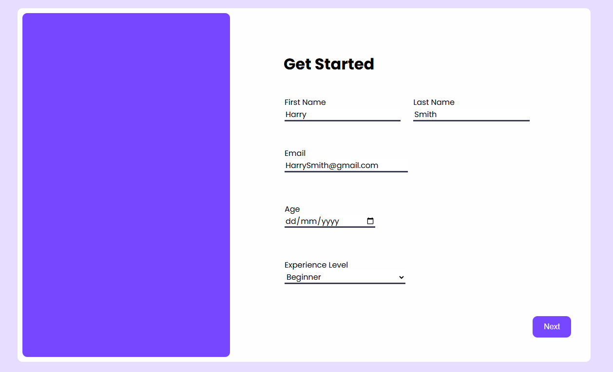

# Data Capture Form

## Image of project

## Overview
I built this data collector form for a proof of concept. I wanted to integrate a full stack application in which I used html,css,js,php,nginx and MySql.
Through using these technologies I got a better understanding of how web applications persist data.

## Tech stack

+ HTML
+ CSS
+ JS
+ PHP
+ Nginx
+ Mysql

